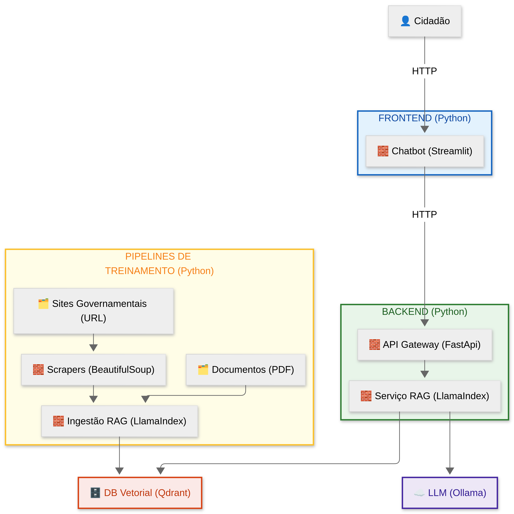
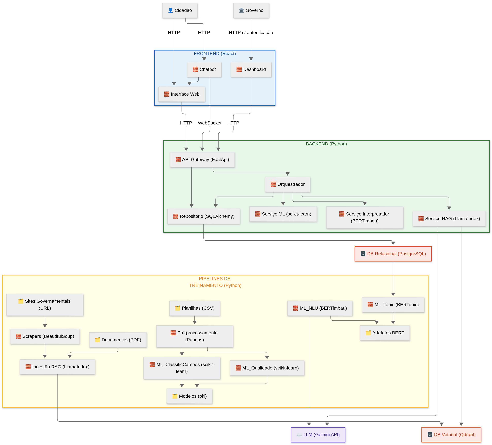

# Arquitetura da Solução

## Diagrama Arquitetural do MVP

**Legenda**

* **🧱 (Blocos de Código):** Serviços, componentes de software, processos.
* **🗂️ (Arquivos/Dados):** Fontes de dados estáticas ou artefatos gerados.
* **🗄️ (Banco de Dados):** Soluções de armazenamento persistente.
* **☁️ (Serviço Externo):** APIs de terceiros.
* **👤 (Ator):** Usuário humano do sistema.

---

### Camada FRONTEND (Python)

A camada de interação direta com o `👤 Cidadão`. É responsável por toda a experiência do usuário.

* **Chatbot (Streamlit):** Ponto de entrada do usuário. Renderiza um formulário que simula a página de envio de manifestações (inspirado no [fala.BR](https://falabr.cgu.gov.br/web/home)) e contêm o chatbot que irá consumir o sistema de IA. Utilização do **Streamlit** para criação da UI do projeto usando python.

### Camada BACKEND (Python)

O núcleo do sistema, responsável pela lógica de negócios, processamento de ML e gerenciamento de dados. É composto por serviços que se comunicam internamente.

* **API Gateway (RestAPI):** Ponto de entrada único do backend (Single Point of Entry). Construído em **FastAPI**, gerencia todas as requisições HTTP, roteando-as para os serviços internos apropriados, primariamente o `Interpretador`.

* **Interpretador:** O "cérebro" da aplicação. Recebe as chamadas da API Gateway e executa a lógica de negócios da conversa:
    1.  Faz o carregamento do NLU (Natural Language Understanding) salvos nos `🗂️ Artefatos BERT` pela pipeline `ML_NLU`.
    2.  Realiza a extração da intenção da mensagem do usuário.
    3.  Com base na intenção, decide qual serviço acionar (neste MVP, o `Serviço RAG`).

* **Serviço RAG:** Responsável pela Geração Aumentada por Recuperação (RAG). Utiliza o **LlamaIndex** para:
    1.  Receber a consulta (e o histórico de chat) do `Interpretador`.
    2.  Buscar por contexto relevante no `🗄️ Banco Vetorial (Qdrant)`.
    3.  Construir o prompt final (consulta + contexto + regras de prompt) e enviá-lo para a `☁️ LLM (Ollama)`.
    4.  Gerenciar a memória da conversa por sessão de usuário.

### Camada de PIPELINES DE TREINAMENTO (Offline)

Processos executados em lote ("offline") que criam os artefatos de ML e os dados necessários para o funcionamento dos serviços de backend.

* **Scrapers:** Scripts (usando BeautifulSoup) que varrem os `🗂️ Sites Governamentais (URL)` em busca de manuais, leis e documentos públicos.
* **Ingestão RAG:** Pipeline do **LlamaIndex** que recebe os `🗂️ Documentos (PDF)` e os dados processados pelos `Scrapers`. Ele é responsável por dividir (chunking), vetorizar (embedding) e inserir esse conhecimento no `🗄️ Banco Vetorial (Qdrant)`.
* **ML_NLU:** Pipeline de treinamento (fine-tuning) do **BERTimbau** para as tarefas de extração de intenção e entidades. Ela é alimentada pela `☁️ LLM (Ollama)` num modelo "Zero Treinamento" com prompt para definição de intenções e entidades e gera os `🗂️ Artefatos BERT` como sua saída.

### Banco de Dados e Serviços Externos

Componentes de armazenamento e APIs de terceiros que suportam a arquitetura.

* **Banco Vetorial (Qdrant):** Por meio da pipeline `Ingestão RAG` Armazena o **conhecimento** da organização (documentos, manuais, heurísticas) em formato de vetores. É lido pelo `Serviço RAG` para realizar buscas semânticas rápidas.
* **LLM (Ollama):** Serviço externo que atua como o cérebro de geração de linguagem. É chamado pelo `Serviço RAG` para formular as respostas finais ao usuário.

## [Esboço] Diagrama Arquitetural Completo

