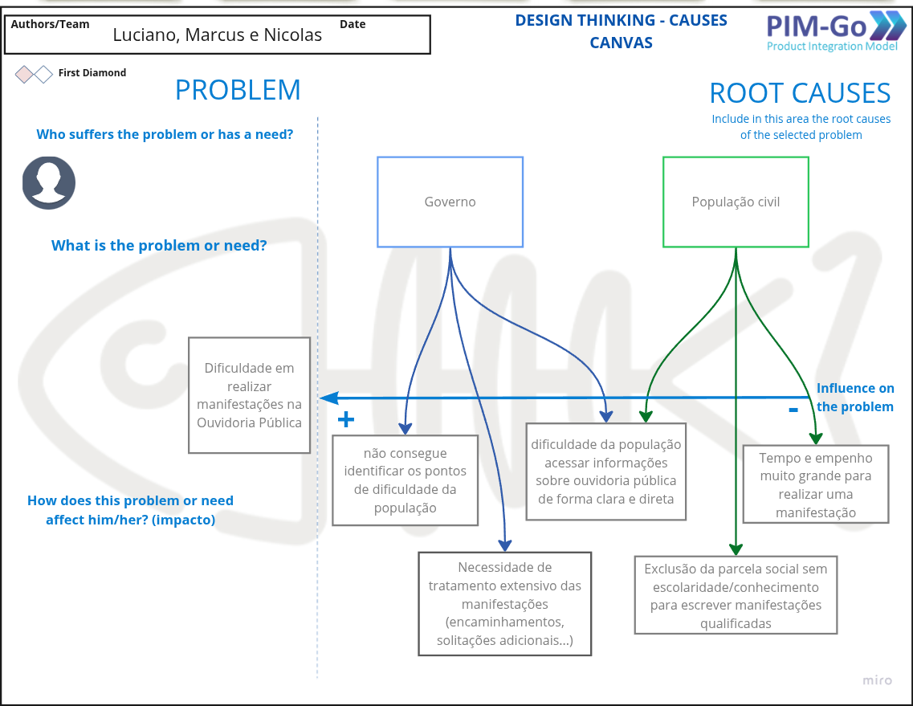
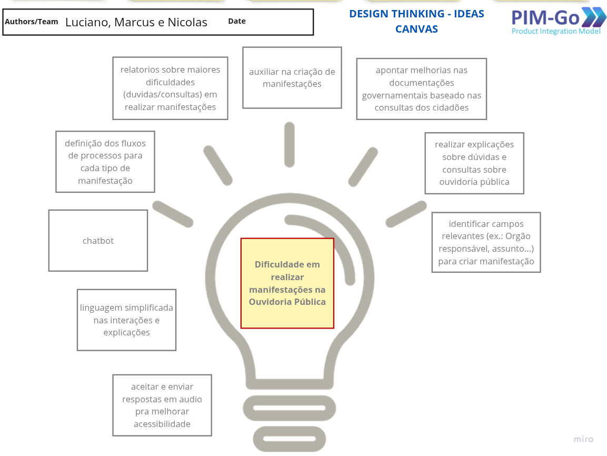
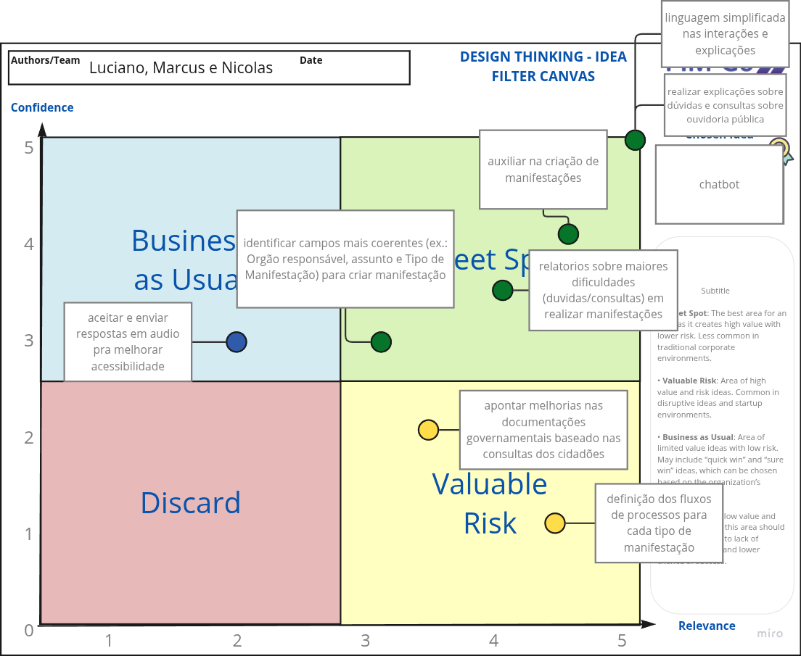

# Descoberta

A fase de Descoberta é o ponto de partida do nosso projeto, onde a equipe se aprofundou para compreender o problema em sua totalidade. O objetivo desta etapa foi ir além dos sintomas e identificar as causas-raiz das dificuldades enfrentadas pelos cidadãos ao interagir com ouvidorias. Para guiar esse processo, utilizamos um conjunto de ferramentas visuais e colaborativas que nos permitiram mapear o problema, divergir com ideias e, finalmente, convergir para uma solução estratégica.

## Diagrama Espinha de Peixe (Fishbone Diagram)

O Diagrama de Causa e Efeito, também conhecido como Diagrama de Ishikawa ou Espinha de Peixe, é uma ferramenta visual utilizada para **explorar e identificar todas as causas potenciais que contribuem para um problema específico**. Ele organiza as causas em categorias, **ajudando a equipe a analisar a situação** de forma estruturada e aprofundada, diferenciando os sintomas das verdadeiras origens do problema.

Aplicamos o diagrama para desconstruir o problema central: "a dificuldade em realizar manifestações na Ouvidoria Pública". Isso nos permitiu mapear as causas relacionadas tanto ao Governo (ex: processos complexos, falta de feedback) quanto à População Civil (ex: falta de conhecimento, dificuldade em escrever textos qualificados), entendendo claramente os impactos e quem é afetado.

## Canva de Ideias

O Canvas de Ideação (ou Canva de Ideias) é um espaço colaborativo para o brainstorming de soluções. O objetivo é **gerar uma grande quantidade e variedade de ideias sem julgamento inicial**, promovendo a criatividade e a exploração de diferentes abordagens para resolver as causas do problema identificado na etapa anterior.

Com as causas do problema bem definidas, usamos o canvas para levantar diversas soluções potenciais. Ideias como "chatbot", "linguagem simplificada", "relatórios para gestores" e "auxílio na criação de manifestações" foram registradas aqui, formando um repositório de possibilidades para o nosso produto.

## Filtro de Ideias

A Matriz de Priorização, neste caso utilizada como um Filtro de Ideias, é uma ferramenta estratégica para **avaliar e selecionar as ideias geradas no brainstorming**. Ela utiliza eixos para comparar as ideias com base em critérios-chave, como valor para o negócio, esforço de implementação ou, como em nosso caso, relevância e confiança. Isso permite que a equipe tome decisões baseadas em dados para focar no que trará mais impacto.

Para definir o escopo do nosso MVP, plotamos as ideias em uma matriz com duas dimensões: **Relevância** (o valor que a ideia agrega ao usuário e ao negócio) e **Confiança** (a confiança da equipe na viabilidade técnica e na clareza da implementação). As ideias que se posicionaram no quadrante "_Sweet Spot_" (alta relevância e alta confiança), como o chatbot, foram priorizadas, formando o núcleo da solução que viria a ser o OuvidorIA.
_
