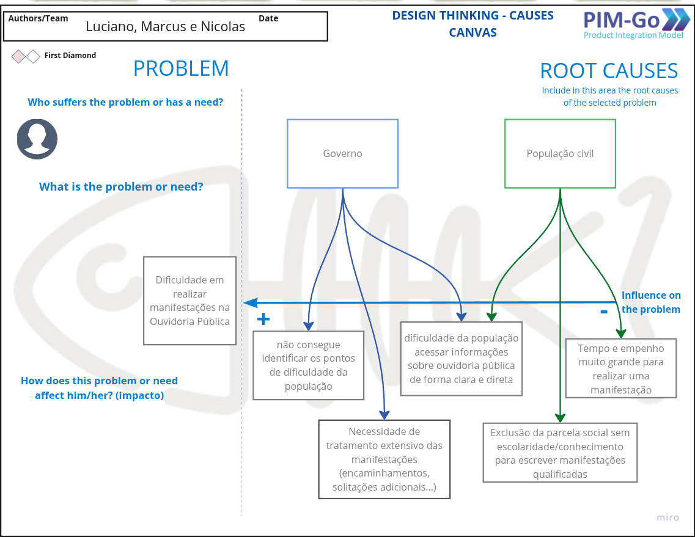
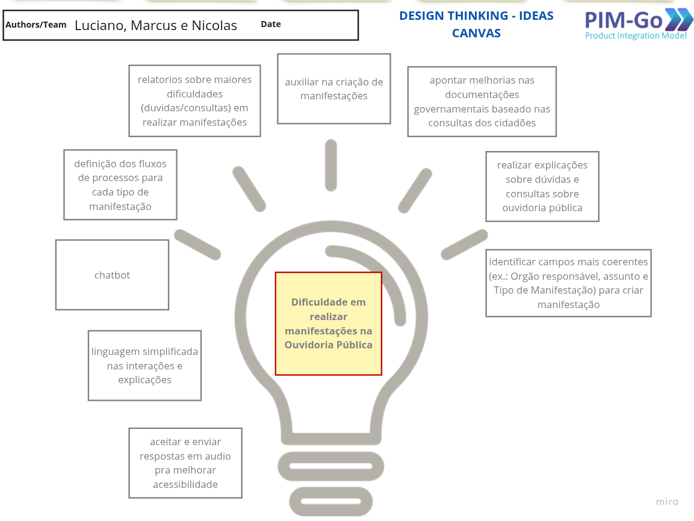

# Descoberta

Durante a descoberta, o time de desenvolvimento realiza uma análise do problema a ser resolvido. Isso envolve identificar o problema em si, seus impactos e quem está sendo afetado. Além disso, nesta etapa, são identificadas e priorizadas as possíveis soluções iniciais.

## Diagrama Espinha de Peixe (Fishbone Diagram)

Esse Diagrama é uma ferramenta útil para identificar o problema, seus impactos e quem é diretamente afetado por eles. A partir desse entendimento, é possível analisar possíveis soluções para resolver o problema definido.

## Canva de Ideias

No Canva de Ideias, foram registradas as principais ideias para abordar o problema e lidar com os impactos associados a ele.

## Filtro de Ideias

O filtro de ideias é uma ferramenta essencial para selecionar as melhores ideias que serão trabalhadas no projeto. Ele funciona com a definição de duas dimensões: relevância para o negócio (eixo horizontal), avaliando quanto de valor essa ideia pode adicionar ao produto, e confiança da equipe (eixo vertical), que indica a dificuldade técnica em implementar a ideia.

Com isso, é possível ter um entendimento claro do problema e selecionar as melhores soluções iniciais para a criação do produto, priorizando aquelas que oferecem maior valor para o negócio e menor dificuldade técnica.

